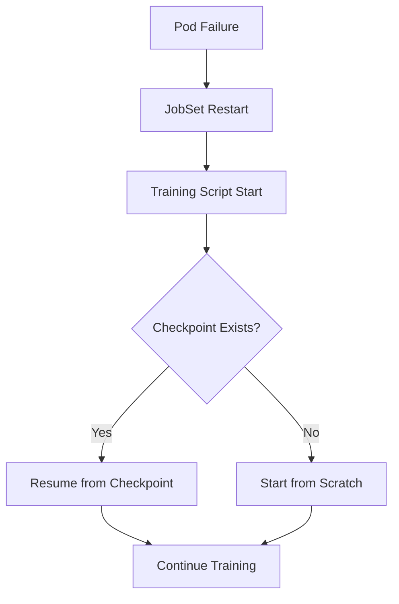
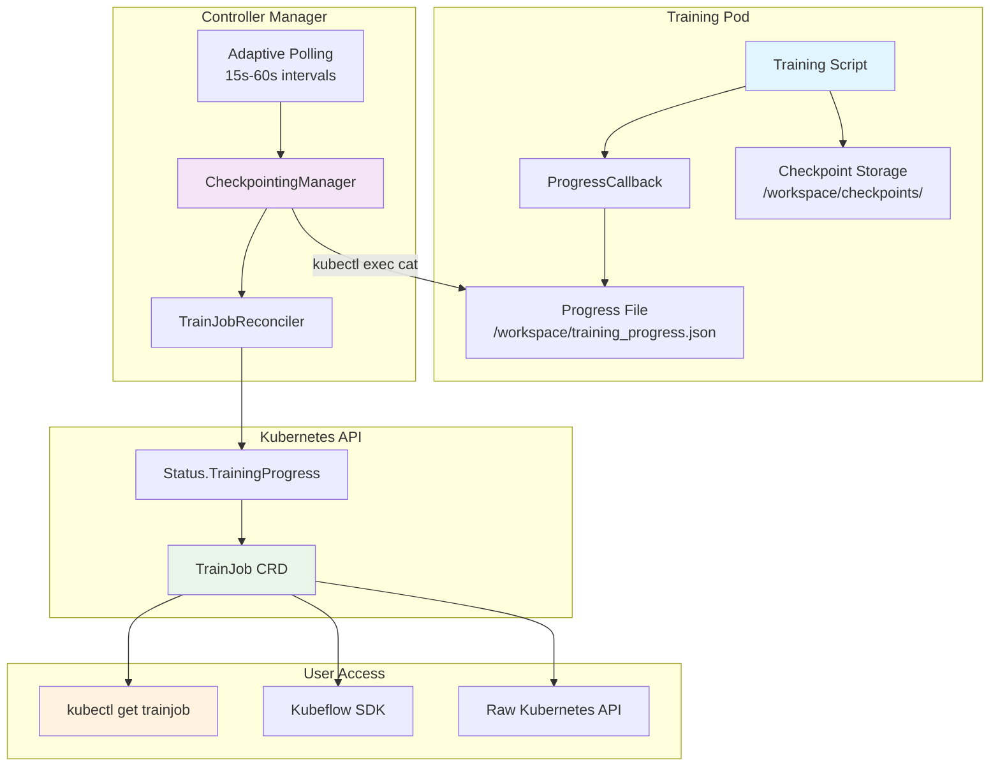
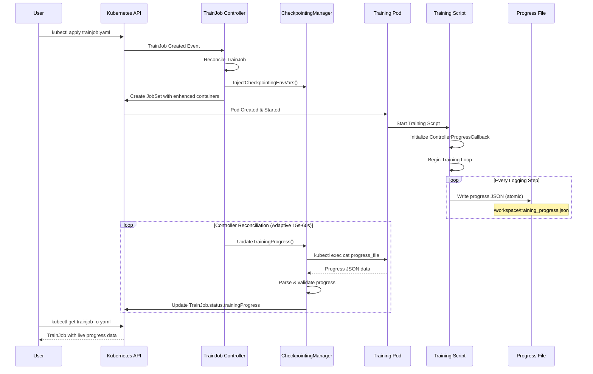
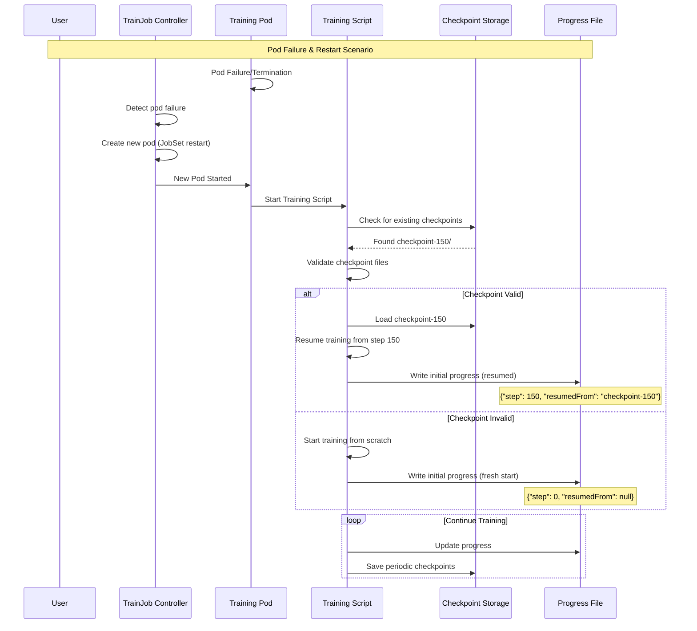

# Model Checkpointing with Trainer v2


##  Files Overview
#### **`trl-trainjob.yaml`**
Complete TrainJob example with enhanced checkpointing:
- **PersistentVolumeClaim**: Shared storage for checkpoints and progress files
- **TrainingRuntime**: Enhanced runtime with checkpointing environment variables
- **TrainJob**: Production-ready job configuration with distributed training
- **Training Script**: Embedded Python script with controller integration

#### **`trl-gpt2-checkpointing.ipynb`**
Interactive Jupyter notebook for:
- **Step-by-step Setup**: Guided implementation walkthrough
- **API Exploration**: Live interaction with TrainJob progress API
- **Debugging**: Interactive troubleshooting and validation

##  Configuration Options

### **Checkpointing Configuration**

```yaml
spec:
  checkpointing:
    enabled: true
    interval: "5m"                    # Checkpoint every 5 minutes
    maxCheckpoints: 3                 # Retain 3 latest checkpoints
    resumeFromCheckpoint: true        # Auto-resume on restart
    storage:
      uri: "/workspace/checkpoints"   # Checkpoint storage path
      accessMode: "ReadWriteMany"     # Multi-pod access
      persistentVolume:
        claimName: "shared-checkpoint-storage"
        mountPath: "/workspace"
```

### **Progress Tracking Configuration**

```yaml
# Environment variables automatically injected by controller
env:
- name: TRAINING_PROGRESS_FILE
  value: "/workspace/training_progress.json"
- name: CHECKPOINT_ENABLED
  value: "true"
- name: CHECKPOINT_URI
  value: "/workspace/checkpoints"
```

### **Distributed Training Configuration**

```yaml
spec:
  trainer:
    numNodes: 2                       # Multi-node training
    numProcPerNode: 1                 # Processes per node
    env:
    - name: LEARNING_RATE
      value: "5e-5"
    - name: BATCH_SIZE
      value: "2"
    - name: MAX_EPOCHS
      value: "3"
```

##  Progress Tracking API

### **Real-Time Progress Access**

```bash
# Get progress-only via raw API

API_SERVER=$(oc config view --minify -o jsonpath='{.clusters[0].cluster.server}')
TOKEN=$(oc whoami -t)
curl -H "Authorization: Bearer $TOKEN" \
-H "Accept: application/json" \
-k "$API_SERVER/apis/trainer.kubeflow.org/v1alpha1/namespaces/NAMESPACE/trainjobs/trl-demo" \
| jq '.status.trainingProgress'

% Total    % Received % Xferd  Average Speed   Time    Time     Time  Current
Dload  Upload   Total   Spent    Left  Speed
100 14904    0 14904    0     0  17150      0 --:--:-- --:--:-- --:--:-- 17150
{
  "checkpointing": {
    "checkpointsCreated": 0,
    "enabled": true,
    "latestCheckpointTime": "2025-09-07T16:06:37Z"
  },
  "epoch": 2,
  "lastUpdateTime": "2025-09-07T16:06:37Z",
  "learningRate": "0.000041",
  "loss": "2.4058",
  "percentComplete": "28.3",
  "step": 354,
  "totalEpochs": 10,
  "totalSteps": 1250
}
```

### **Progress Data Structure**

```json
{
  "epoch": 2,
  "totalEpochs": 3,
  "step": 150,
  "totalSteps": 300,
  "loss": "0.4523",
  "learningRate": "0.000050",
  "percentComplete": "50.0",
  "lastUpdateTime": "2024-01-15T10:30:00Z",
  "checkpointing": {
    "enabled": true,
    "latestCheckpoint": "/workspace/checkpoints/checkpoint-150",
    "checkpointsCreated": 3,
    "latestCheckpointTime": "2024-01-15T10:25:00Z"
  }
}
```

### **Fault Recovery Flow**



### **Multi-Storage Checkpointing**

Configure multiple storage backends:

```yaml
spec:
  checkpointing:
    storage:
      uri: "s3://my-bucket/checkpoints"
      secretRef:
        name: s3-credentials
    # Fallback to local storage
    persistentVolume:
      claimName: "local-checkpoint-storage"
```

### **Custom Environment Variables**

Override default checkpointing behavior:

```yaml
spec:
  checkpointing:
    env:
    - name: CHECKPOINT_STRATEGY
      value: "epoch"  # or "steps", "time"
    - name: CHECKPOINT_SAVE_TYPE
      value: "full"   # or "incremental"
    - name: PROGRESS_UPDATE_FREQUENCY
      value: "5"      # Update every 5 steps
```

## 📚 Additional Resources

- **[Trainer v2 Documentation](https://kubeflow.org/docs/components/training/)**
- **[TRL Library Guide](https://huggingface.co/docs/trl/)**
- **[Distributed Training Best Practices](https://pytorch.org/tutorials/distributed/)**
- **[Kubernetes Operator Patterns](https://kubernetes.io/docs/concepts/extend-kubernetes/operator/)**

###  **System Architecture Overview**

The enhanced checkpointing system consists of 3 main components:

1. **Training Script Integration**: Progress callbacks that write standardized JSON progress files
2. **Controller Enhancement**: `CheckpointingManager` that reads progress and updates TrainJob status
3. **API Enhancement**: Extended CRD schema for progress tracking and checkpointing configuration

###  **Complete System Flow**



###  **Detailed Component Structure**

#### **1. Training Script Integration**
```python
# Progress tracking callback structure
class ControllerProgressCallback(TrainerCallback):
    def __init__(self):
        self.progress_file = os.environ.get('TRAINING_PROGRESS_FILE', '/workspace/training_progress.json')
        self.checkpoint_enabled = os.environ.get('CHECKPOINT_ENABLED', 'false').lower() == 'true'
    
    def _save_progress(self, state: TrainerState, epoch: int = None):
        # Only rank 0 writes progress in distributed training
        rank = int(os.environ.get('RANK', '0'))
        if rank != 0:
            return
            
        progress_data = {
            "epoch": epoch or int(state.epoch) if state.epoch else 1,
            "totalEpochs": int(state.num_train_epochs) if state.num_train_epochs else 1,
            "step": state.global_step,
            "totalSteps": state.max_steps,
            "loss": f"{state.log_history[-1].get('train_loss', 0.0):.4f}" if state.log_history else "0.0000",
            "learningRate": f"{state.log_history[-1].get('learning_rate', 0.0):.6f}" if state.log_history else "0.000000",
            "percentComplete": f"{(state.global_step / state.max_steps * 100):.1f}" if state.max_steps > 0 else "0.0",
            "lastUpdateTime": time.strftime("%Y-%m-%dT%H:%M:%SZ", time.gmtime())
        }
        
        # Atomic write for controller consumption
        temp_file = self.progress_file + '.tmp'
        with open(temp_file, 'w') as f:
            json.dump(progress_data, f, indent=2)
        os.rename(temp_file, self.progress_file)
        os.chmod(self.progress_file, 0o644)
```

#### **2. Controller Architecture**
```go
// CheckpointingManager structure
type CheckpointingManager struct {
    client    client.Client
    clientset kubernetes.Interface
    config    *rest.Config
    log       logr.Logger
}

// Core methods
func (cm *CheckpointingManager) UpdateTrainingProgress(ctx context.Context, trainJob *trainer.TrainJob) error
func (cm *CheckpointingManager) readProgressFromPods(ctx context.Context, trainJob *trainer.TrainJob) (*ProgressData, error)
func (cm *CheckpointingManager) readProgressFromPod(ctx context.Context, pod *corev1.Pod) (*ProgressData, error)
func (cm *CheckpointingManager) InjectCheckpointingEnvVars(containers []corev1.Container, trainJob *trainer.TrainJob) []corev1.Container
```

#### **3. API Schema Structure**
```yaml
# TrainJob CRD Enhancement
apiVersion: trainer.kubeflow.org/v1alpha1
kind: TrainJob
spec:
  checkpointing:
    enabled: true                    # Enable checkpointing
    interval: "5m"                   # Checkpoint interval
    maxCheckpoints: 3                # Retention policy
    resumeFromCheckpoint: true       # Auto-resume capability
    storage:
      uri: "/workspace/checkpoints"  # Storage location
      accessMode: "ReadWriteMany"    # Multi-pod access
      persistentVolume:
        claimName: "shared-checkpoint-storage"
        mountPath: "/workspace"

status:
  trainingProgress:
    epoch: 2                         # Current epoch
    totalEpochs: 3                   # Total epochs
    step: 150                        # Current step
    totalSteps: 300                  # Total steps
    loss: "0.4523"                   # Training loss
    accuracy: "0.8756"               # Training accuracy
    validationLoss: "0.5123"         # Validation loss
    validationAccuracy: "0.8234"     # Validation accuracy
    learningRate: "0.000050"         # Current learning rate
    percentComplete: "50.0"          # Progress percentage
    estimatedTimeRemaining: "45m"    # ETA
    lastUpdateTime: "2024-01-15T10:30:00Z"
    checkpointing:
      enabled: true
      latestCheckpoint: "/workspace/checkpoints/checkpoint-150"
      checkpointsCreated: 3
      latestCheckpointTime: "2024-01-15T10:25:00Z"
```

###  **Detailed Sequence Diagrams**

#### **1. Training Job Lifecycle with Progress Tracking**



#### **2. Distributed Training Progress Coordination**

```mermaid
sequenceDiagram
    participant Controller as TrainJob Controller
    participant CM as CheckpointingManager
    participant Pod0 as Training Pod (Rank 0)
    participant Pod1 as Training Pod (Rank 1)
    participant Pod2 as Training Pod (Rank 2)
    participant PF as Progress File
    participant CS as Checkpoint Storage

    Note over Pod0,Pod2: Distributed Training (3 nodes)
    
    Pod0->>Pod0: RANK=0, writes progress
    Pod1->>Pod1: RANK=1, no progress write
    Pod2->>Pod2: RANK=2, no progress write
    
    loop Training Steps
        Pod0->>PF: Write progress (rank 0 only)
        Pod0->>CS: Save checkpoint
        Pod1->>CS: Save checkpoint
        Pod2->>CS: Save checkpoint
        Note over Pod0,Pod2: All pods save checkpoints<br/>Only rank 0 writes progress
    end
    
    Controller->>CM: UpdateTrainingProgress()
    CM->>CM: List pods with jobset label
    
    loop Try each running pod
        CM->>Pod0: kubectl exec cat progress_file
        Pod0-->>CM: Progress data (rank 0)
        break Success - use this data
        CM->>Pod1: kubectl exec cat progress_file  
        Pod1-->>CM: No progress file (rank 1)
        CM->>Pod2: kubectl exec cat progress_file
        Pod2-->>CM: No progress file (rank 2)
    end
    
    CM->>Controller: Return progress from rank 0
    Controller->>Controller: Update TrainJob status
```

#### **3. Checkpoint Resume Flow**

